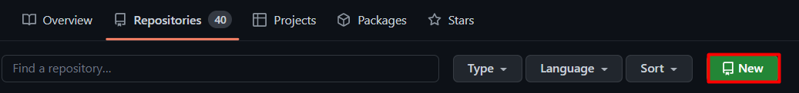
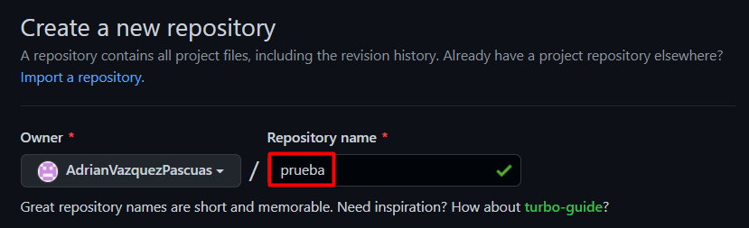
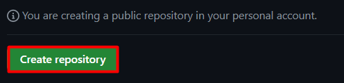
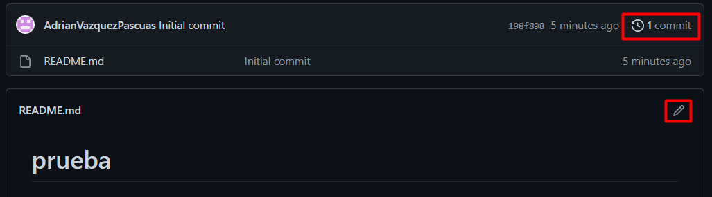
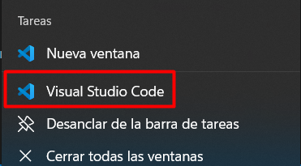
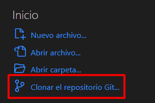
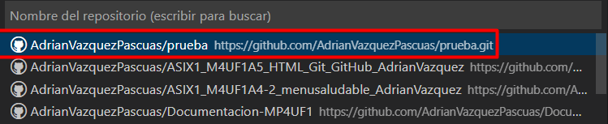
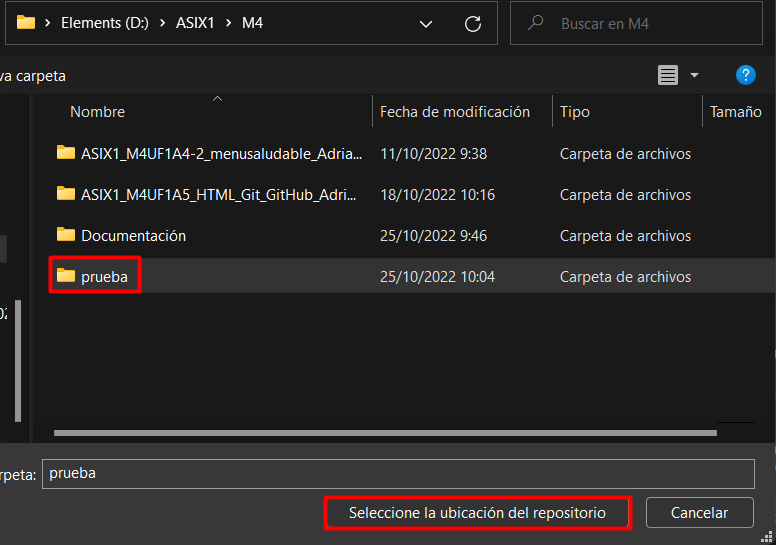
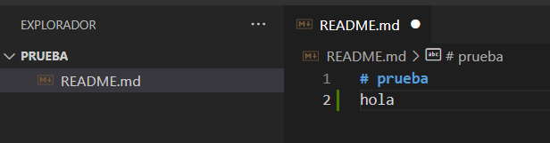
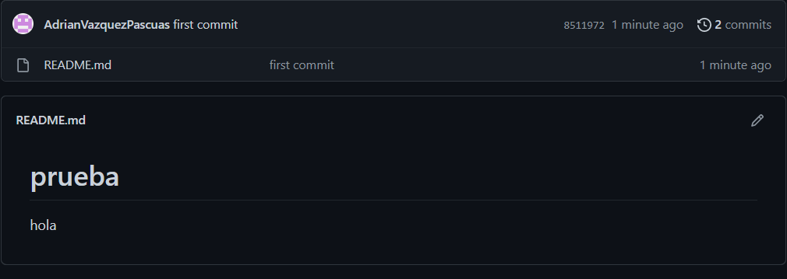

# Documentacion-MP4UF1

   <h2>Github</h2>
   
### Crear un repositorio
Lo primero que debemos de hacer en entrar en Github e ir a Repositorios, a continuación le damos a New.


Ponemos el nombre al repositorio.


Cuando hayamos puesto el nombre al repositorio le damos a crear repositorio.


Ahora que ya hemos creado el repositorio podemos ir modificandolo donde se encuentra el lapiz y en la parte superior salen los cambios. realizados.


### Pasar repositorio a local
Tenemos que ir a Visual Studio Code.


Le damos a clonar el repositorio Git.


Selecionamos el repositorio que habiamos creado antes.


Ahora selecionamos donde queremos que se guarde en local.


Entramos y ponemos algo para que cuando lo subamos se vea el cambio.


```
Lo primero que tenemos que poner es git add . para seleccionar todo, git commit -m "", entre las comillas ponemos como queremos que se guarde el cambio y por ultimo git push para que se suba el cambio
```

Ahora que lo hemos subido vemos que se ha hecho correctamente en el repositorio de Github.


   <h2>Markdown</h2>
# Para crear encabezados, máximo de 6, cuantos más # más pequeña será la letra.

**	Hace la letra negrita.

<p>*	Hace la letra cursiva.</p>

~~	Hace la letra tachada.

***	Todo el texto en negrita y cursiva.

Texto	Copia todo lo que hay dentro usando (``` al abrir y cerrar).
```
Texto de prueba
```

Ejemplo:

``` html
    <!DOCTYPE html>
<html lang="en">
<head>
<meta charset="UTF-8">
<meta http-equiv="X-UA-Compatible" content="IE=edge">
<meta name="viewport" content="width=device-width, initial-scale=1.0">
<title>Document</title>
</head>
<body>
</body>
</html>
```
> 	Para citar el texto.
[ ] ( )	Crear un enlace en el texto del enlace entre corchetes [ ],y la URL entre paréntesis ( ).
 -- | 	Puede crear tablas con barras verticales | y guiones -.

Ejemplo:

| Aplicaciones | Visto |
|--------------| ---------------|
| Google Docs | ✔️ |
| Google Slides | ✔️ |
| Google Sheets | ✔️ |
|Google Calendar | 📆 |
|Google Meet | 💻 |
| ... | ... |

Se utiliza la exclamación al principio y el enlace no será otro que la ubicación de la imagen.
<p></p>

Para crear listas desordenadas utiliza * asteriscos, - guiones, o + símbolo de suma.

Para crear listas ordenadas debes utilizar la sintaxis de tipo: «número.» 1. 

Para que se ignore el markdown lo que debemos de hacer es utilizar la barra invertida (\).

<h2>HTML</h2>
HTML no es un lenguaje de programación; es un lenguaje de marcado que define la estructura de tu contenido.
Si quieres especificar que se trata de un párrafo, podrías encerrar el texto con la etiqueta de párrafo (p):

```
<p>Esto es un parrafo.</p>
```

Las partes principales del elemento son:
1.La etiqueta de apertura: consiste en el nombre del elemento (en este caso, p), encerrado por < y >.


2.La etiqueta de cierre: es igual que la etiqueta de apertura, excepto que incluye una barra de cierre (/) antes del nombre de la etiqueta.


3.El contenido: este es el contenido del elemento, que en este caso es sólo texto.


4.El elemento: la etiqueta de apertura, más la etiqueta de cierre, más el contenido equivale al elemento.


El elemento de imagen HTML (img) representa una imagen en el documento.

```
img src="link.png" alt="Ejemplo"
```


El elemento de encabezado va desde h1 hasta h6, donde h1 es el titulo principal y h6 es un sub-subtitulo.


Listas:
Las listas desordenadas son aquellas en las que el orden de los items no es relevante, como en una lista de compras. Estas son encerradas en un elemento (ul).
Las listas ordenadas son aquellas en las que el orden sí es relevante, como en una receta. Estas son encerradas en un elemento (ol).
Cada elemento de la lista se coloca dentro de un elemento (li).

<h2>Github</h2>
<b>Selectores:</b>
Un selector es un conjunto de reglas de estilos aplicadas múltiples elementos de la hoja html. Hay 3 tipos:

   -Id: Se define mediante una # justo antes del nombre de la id.
```
#id{
/* Estilos */
}
```

   -Clase: Se define mediante un . justo antes del nombre de la clase.
```
.clase{
/* Estilos */
}
```

   -Elementos: Aplica estilo a todos los elementos que tengan la etiqueta html indicada.
```
div{
/* Estilos */
}
```

<h2>CSS</h2>
CSS son las siglas en inglés de Cascading Style Sheets, que significa «hojas de esilo en cascada». Es un lenguaje que se usa para estilizar elementos escritos en un lenguaje de marcado como HTML.
Por ejemplo:
```
<p>Esto es un parrafo.</p>
```

```
p {
 color: blue;
 text-weight: bold;
}
```
Al aplicar estos estilos todos los elementos (p) aparecerán en color azul y en negrita.

## Selectores básicos
### Selector de tipo
Selecciona todos los elementos que coinciden con el nombre del elemento especificado.
Ejemplo: h1 se aplicará a cualquier elemento h1.

### Selector de clase
Selecciona todos los elementos que tienen el atributo de class especificado.
Ejemplo: .footer seleccionará cualquier elemento que tenga la clase "footer".

### Selector de ID
Selecciona un elemento basándose en el valor de su atributo id. Solo puede haber un elemento con un determinado ID dentro de un documento.
Ejemplo: #encabezado se aplicará a cualquier elemento que tenga el ID "encabezado".


